# HoK_SQL
These are my SQL projects and practice.

## PROJECT 1, Data Exploration, SQL: WSDA Music Shop Discrepancy

This is a project I worked on to practice my SQL skills. I downloaded the database from the internet and imported it into SQL. The project and database is locate in the projects folder of my SQL repository.  

The scenario is set that we are working for WSDA Music, and the manager discovers there is a discrepancy in the financials that he has been unable to pinpoint. However, he knows it was between 2011 and 2012. The manager wants me to analyze the data to get a list of suspects, narrow the list, and pinpoint the suspect(s).  

To do this, we explore some general queries that will give context clues. we want to look for  
**1. How many transactions took place between the years 2011 and 2012?  
2. How much money did WSDA Music make during the same period?**  
  
For the first context clue, we come up with the SQL code:  
  
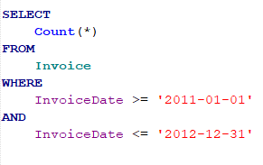
  
This counts all data from the invoice table between the dates January 1, 2011, and December 31, 2012, including those dates. The count gives us an output of 167, meaning 167 transactions took place in that time period.  

To determine the income between 2011 and 2012, we use the code  

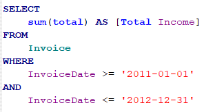

This code sums the total column from the invoice table and renames the column 'Total Income' for the income values between 2011 and 2012. After running the code, we find out the store made $1947.97 from transactions in that time.

Now that we have general insight, we want to target the queries to data containing customers and employees. We then want to look for:

**1. A list of customers who made purchases between 2011 and 2012.  
2. A list of customers, sales reps, and total transaction amounts for each customer 
between 2011 and 2012.  
3. How many transactions are above the average transaction amount during the same 
time period?  
4. What is the average transaction amount for each year that WSDA Music has been 
in business?**  

To get a list of customers, we come up with the code:

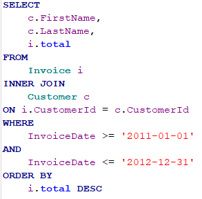

This code selects the FirstName and LastName columns from the customer table and the total column from the Invoice table. It then joins the two tables with matching values from each table on the customerId column between 2011 and 2012 and sorts the new table from largest to smallest total transaction amount.

To generate a list of customers, sales reps, and total transaction amounts for each customer 
between 2011 and 2012, we alter the previous code slightly to get:

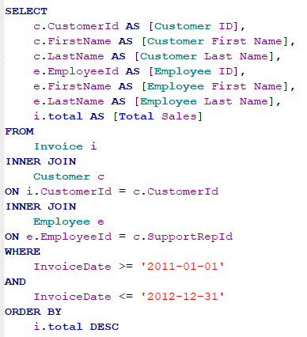

This alteration joins the Employee table to the current table by the Customer table by the EmployeeId column and adds the columns CustomerId from the Customer table and the columns EmployeeId, FirstName, and LastName from the Employee table. This also adds names to each of the columns that explain more to the viewers of the table.

To figure out how many transactions are above the average transaction amount during the same 
time period, we want to use a function. To figure this out We use the following code:

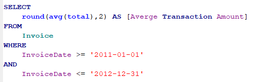

This code finds the average transaction amount between 2011 and 2012 from the data and rounds the output to 2 decimal points. The code also renames the column to Average Transaction Amount.
We find the average transaction amount to be $11.66 based on the output.

We will use the previous code as a subquery to find out how many transactions are above the average transaction amount during the same time period.

After adding the outer query we get the code:

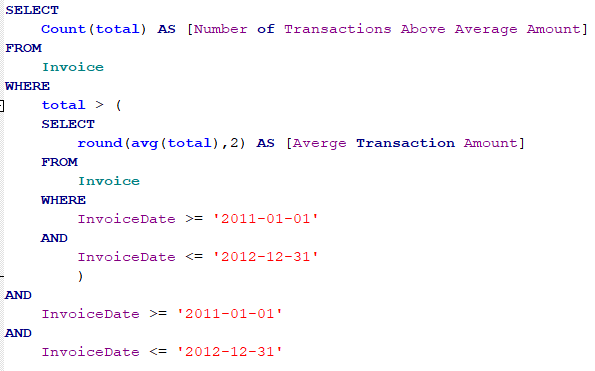

This code counts the total number of transactions where the total is above the average transaction amount, which we used as our subquery, between 2011 and 2012. We then find out the number of transactions above the average amount is 26.

We now want to compare the average transactions for the years to other years, in this case, every year the hypothetical business has been open, to see if it looks suspicious. We do this with the code:

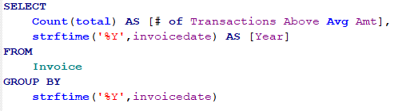

This code counts the total number of transactions, and it takes the invoice date as a formatted string from the invoice table and groups them by year.

Since we know the number of transactions per year is similar, we know that's not where the unaccounted money comes from. We then look at the next steps and narrow down our search with the following tasks:

**1. Get a list of employees who exceeded the average transaction amount from sales they 
generated during 2011 and 2012.  
2. Create a Commission Payout column that displays each employee’s commission   
based on 15% of the sales transaction amount.  
3. Determine which employee made the highest commission?  
4. List the customers that the employee identified in the last question.  
5. Figure out which customer made the highest purchase?  
6. Look at the customer record—decide if I see anything suspicious.  
7. Conclude who is our primary person of interest?**  

To get a list of employees who exceeded the average transaction amount from sales they 
generated during 2011 and 2012, I came up with the code:

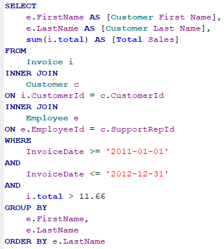

This code combines the customer table and invoice table by all matching values on the customer ID and then joins the employee table on that table based on matching values on the employee ID. From those tables, this code displays the first name and last name from the employee table and the sum of the total sales above the average transaction amount ($11.66) between 2011 and 2012 for each employee's first and last name and orders the table in alphabetical order by last name. 

We can alter the previous code to add a column to show the employees' 15% commission. The code we end up with is:

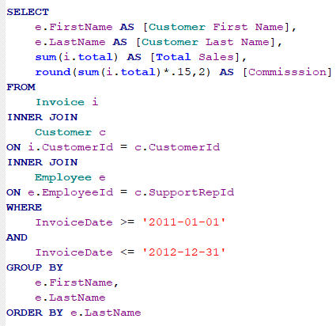

The only difference in this code is the line **round(sum(i.total)*.15,2) AS \[Commisssion\]**. Adding this line to the select clause multiplies the total sum of the employee's transactions by 15% and rounds the total to 2 decimal places. 

The output shows Jane Peacock has a significantly higher commission. This raises suspicion, so we should look closer into the employee. The next step is to look into the list of customers that the employee helped, so we create the code:

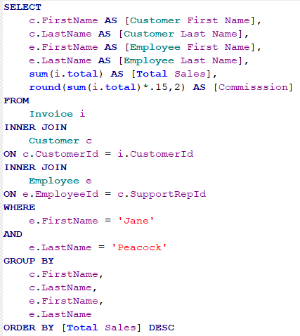

This code adds the customer's first and last name that Jane helped ad orders the data from highest to lowest in total sales.

The output shows John Doeein looks suspicious because the sales and commission are significant compared to the other customers. So we want to look into the customer to check their records. To do this we use the code:  

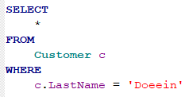

This code shows us all the records for John Doeein. Since the customer has no other records, it seems suspicious so Jane Peacock is the primary suspect in the financial discrepancy.

